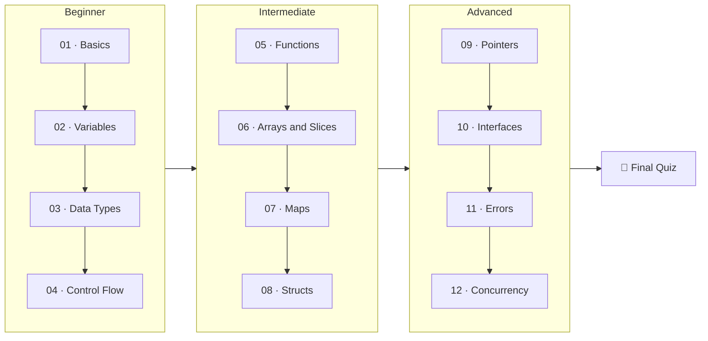

# GoLang Learning

An incremental Go programming course organized in easy-to-follow lessons — from `package main` to goroutines and channels.

## Prerequisites

- [Go](https://golang.org/dl/) installed (version 1.18+)
- VS Code with the [Go extension](https://marketplace.visualstudio.com/items?itemName=golang.Go)

## Course Roadmap



!!! tip "How to use this course"
    1. **Work sequentially** — each lesson builds on the previous ones.
    2. **Type the code yourself** — don't copy/paste; muscle memory matters.
    3. **Run every example** — `cd` into the lesson folder and `go run main.go`.
    4. **Make mistakes on purpose** — errors teach you more than success.
    5. **Take the quiz** at the end of each lesson to check understanding.

## Quick Reference

| Command              | Description           |
|:---------------------|:----------------------|
| `go run filename.go` | Run a Go file         |
| `go build`           | Compile the program   |
| `go fmt`             | Format your code      |
| `go test`            | Run tests             |
| `go mod tidy`        | Clean up dependencies |

## Project Layout

All runnable code lives in a single `code/` package — one file per lesson, dispatched by `main.go`:

```
GoLangLearning/
├── code/
│   ├── main.go               # lesson dispatcher: go run . <lesson>
│   ├── 01_basics.go          # Hello World, packages, imports
│   ├── 02_variables.go       # Declaration, inference, constants, ScanInput
│   ├── 03_datatypes.go       # Ints, floats, strings, runes, bools, conversion
│   ├── 04_controlflow.go     # If/else, switch, loops
│   ├── 05_functions.go       # Returns, variadic, closures
│   ├── 06_arrays_slices.go   # Arrays, slices, iteration
│   ├── 07_maps.go            # Key-value data structures
│   ├── 08_structs.go         # Structs, methods, embedding
│   ├── 09_pointers.go        # Memory references
│   ├── 10_interfaces.go      # Abstraction, polymorphism
│   ├── 11_errors.go          # Error handling patterns
│   └── 12_concurrency.go     # Goroutines, channels
├── docs/                  # This site (MkDocs sources)
├── mkdocs.yml             # Site config
└── go.mod
```

Run any lesson from inside `code/`:

```bash
cd code
go run .              # list lessons
go run . 6            # or: go run . slices
go run . scan         # interactive stdin demo
```

## Resources

- [Official Go Documentation](https://golang.org/doc/)
- [Go by Example](https://gobyexample.com/)
- [A Tour of Go](https://tour.golang.org/)
- [Effective Go](https://golang.org/doc/effective_go)
