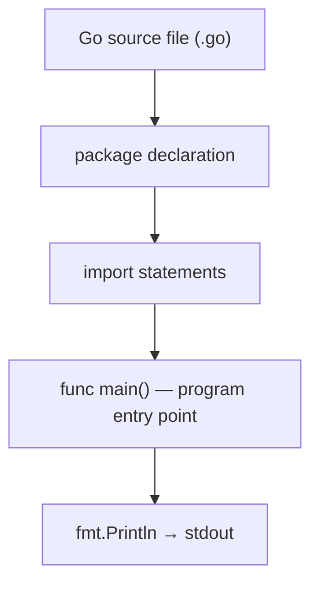

# Lesson 1: Go Basics

## Big Picture



Every executable Go program follows this skeleton: declare the package, import what you need, and put your logic in `main()`.

### Printing
- `fmt.Println()` — print with newline
- `fmt.Print()` — print without newline
- `fmt.Printf()` — formatted printing

## Go Naming and Access Conventions

Go uses the first letter of a name to control whether other packages can access it:

- **Capitalized names are exported**: `Println`, `NewServer`, and `User` can be accessed from another package.
- **Lowercase names are package-private**: `main`, `calculateTotal`, and `user` can only be accessed from within the same package.
- Capitalize a function, type, variable, constant, method, or struct field only when it is part of the package's public API.
- Prefer lowercase names for implementation details that callers do not need.

- Use a dot to access an exported identifier from an imported package:
    - Here, `fmt` is the package name and `Println` is an exported function. `main` stays lowercase because the Go runtime looks for that exact special function name; it is not called from another package.

- The same export rule applies to struct fields:

    ```go
    package profile

    type User struct {
        Name     string // accessible as user.Name from another package
        password string // accessible only inside package profile
    }
    ```

Common naming conventions:

- Use `camelCase` for unexported names and `PascalCase` for exported names; do not use underscores.
- Keep package names short, lowercase, and singular, such as `http`, `json`, or `profile`.
- Avoid repeating the package name: prefer `http.Server` over `http.HTTPServer`.
- Acronyms normally keep consistent capitalization: `userID`, `UserID`, `HTTPClient`, and `ServeHTTP`.
- Use short names like `i` in small scopes, but descriptive names like `customerCount` in larger scopes.

## Code Walkthrough

=== "Runnable example"

    ```go
    //Every Go file starts with `package main` (for executable programs)
    package main

    import "fmt" //Import Statement

    func main() {
        fmt.Println("Hello, Go!")       // newline
        fmt.Print("no newline ")
        fmt.Printf("formatted: %d\n", 42)

        name := "world"
        fmt.Printf("Hello, %s\n", name)
    }
    ```

!!! tip "Exercises"
    1. Modify the hello message.
    2. Try `fmt.Print` vs `fmt.Println` — what's different?
    3. Use `fmt.Printf` with `%d`, `%s`, and `%f` format specifiers.

## Check Your Understanding

<quiz>
What must every executable Go program declare at the top of its entry file?
- [x] `package main`
- [ ] `package go`
- [ ] `import main`
- [ ] `func start()`
</quiz>

<quiz>
Why can't the `code/` package have `func main()` in every lesson file?
- [ ] `main` must be lowercase
- [x] A package can only have one `main` — it's the runtime entry point
- [ ] `main` requires a return value
- [ ] Only `main.go` may define functions
</quiz>

<quiz>
Which `fmt` function prints a formatted string like `"Age: %d"`?
- [ ] `fmt.Println`
- [x] `fmt.Printf`
- [ ] `fmt.Print`
- [ ] `fmt.Format`
</quiz>


=== "Runnable example"

    ```go
    name := "Go"
    fmt.Println("Hello,", name)
    ```