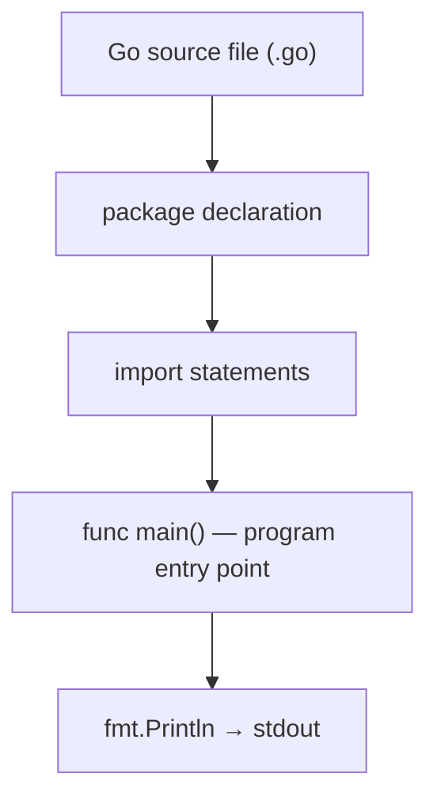
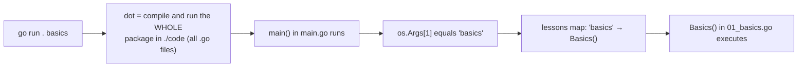

# Lesson 1: Go Basics

## Big Picture



Every executable Go program follows this skeleton: declare the package, import what you need, and put your logic in `main()`.

## Concepts

### Package Declaration
Every Go file starts with `package main` (for executable programs).

### Import Statement
```go
import "fmt"  // Single import
```

### The Main Function
```go
func main() {
    // Your code here
}
```

### Printing
- `fmt.Println()` — print with newline
- `fmt.Print()` — print without newline
- `fmt.Printf()` — formatted printing

## Code Walkthrough

=== "01_basics.go"

    ```go
    --8<-- "code/01_basics.go"
    ```

=== "main.go (dispatcher)"

    ```go
    --8<-- "code/main.go"
    ```

## How Does `go run . basics` Work?

`basics` is **not** a file name, class name, or interface — Go has no classes. It's a plain
command-line *string argument* that a lookup table maps to a function.



Breaking it down:

1. **`go run .`** — the `.` means "the package in the current directory". Go compiles
   *all* `*.go` files in `code/` together (they're all `package main`) and runs `main()`.
   The file name `01_basics.go` plays no role — Go doesn't dispatch by filename.
2. **`basics`** — just text in `os.Args`, the program's argument list
   (`os.Args[0]` is the program name, `os.Args[1]` is `"basics"`).
3. **`main.go` dispatcher** — a `map[string]func()` named `lessons` maps that string to
   the function `Basics` (an exported package-level function in `01_basics.go`):

    ```go
    var lessons = map[string]func(){
        "basics": Basics,
        "1":      Basics,   // aliases work too
        // ...
    }
    ```

4. So `go run . basics`, `go run . 1`, and `go run . slices` are all just
   **map keys → function calls**. No reflection, no classes — a lookup table.

### `func main()` vs `func Basics()` — what's the difference?

| | `func main()` | `func Basics()` |
|:--|:--|:--|
| Who calls it | The Go **runtime** — entry point | **Your code** — an ordinary function |
| How many per package | Exactly **one** (a second one won't compile) | As many as you like |
| Signature | Fixed: no params, no returns | Anything |
| Capitalization | `main` is lowercase yet still the entry point — the rule is the *name*, not export status | `Basics` capitalized = **exported** (visible to other packages) |

This is precisely *why* the code/ package is structured this way: all 12 lessons live in one
`package main`, and a package can only have one `main()`. So each lesson became an ordinary
function (`Basics()`, `Variables()`, …) and the single real `main()` in `main.go` dispatches to
them through the map.

Two notes that come up in interviews:

- `func()` in `map[string]func()` is a **function type** — "no args, no returns". Any function
  matching that signature can be a value in the map (see Lesson 5).
- Exported vs unexported doesn't actually matter inside `package main` (nobody imports a main
  package) — we capitalize `Basics()` anyway because it's the convention for top-level lesson
  entry points. `basics()` would work identically.

!!! example "Try it yourself"
    ```bash
    cd code
    go run .            # lists every registered lesson key
    go run . basics     # runs Basics()
    go run . 1          # same thing — alias in the map
    go run . nope       # "Unknown lesson: nope"
    ```

!!! tip "Exercises"
    1. Modify the hello message.
    2. Try `fmt.Print` vs `fmt.Println` — what's different?
    3. Use `fmt.Printf` with `%d`, `%s`, and `%f` format specifiers.

## Check Your Understanding

<quiz>
What must every executable Go program declare at the top of its entry file?
- [x] `package main`
- [ ] `package go`
- [ ] `import main`
- [ ] `func start()`
</quiz>

<quiz>
Why can't the `code/` package have `func main()` in every lesson file?
- [ ] `main` must be lowercase
- [x] A package can only have one `main` — it's the runtime entry point
- [ ] `main` requires a return value
- [ ] Only `main.go` may define functions
</quiz>

<quiz>
Which `fmt` function prints a formatted string like `"Age: %d"`?
- [ ] `fmt.Println`
- [x] `fmt.Printf`
- [ ] `fmt.Print`
- [ ] `fmt.Format`
</quiz>
