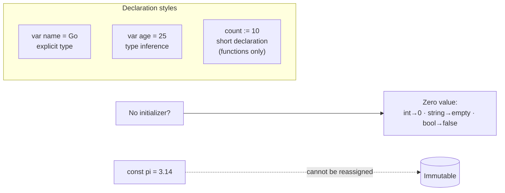

# Lesson 2: Variables

## Big Picture



`var` works anywhere; `:=` is a shortcut only allowed inside functions. Pick `:=` when the type is obvious — it's the idiomatic default.

## Concepts

### Declaration Methods
```go
// Explicit type
var name string = "Go"

// Type inference
var age = 25

// Short declaration (inside functions only)
count := 10
```

### Constants
```go
const pi = 3.14159
const maxSize = 100
```

### Zero Values
Variables declared without initialization get zero values:

| Type      | Zero value |
|:----------|:-----------|
| `int`     | `0`        |
| `string`  | `""`       |
| `bool`    | `false`    |
| `float64` | `0.0`      |

## Code Walkthrough

=== "Runnable example"

    ```go
    package main

    import "fmt"

    func main() {
        var name string = "Go"   // explicit type
        var age = 10             // inferred
        version := 1.23          // short declaration

        var count int            // zero value: 0
        var ready bool           // zero value: false

        fmt.Println(name, age, version, count, ready)
    }
    ```

Full program: `code/02_variables.go`.

!!! example "Try it yourself"
    ```bash
    cd code
    go run . variables   # declaration demo
    go run . scan        # interactive fmt.Scan demo
    ```

!!! tip "Exercises"
    1. Declare a variable with `var` and no initializer — print its zero value.
    2. Try assigning a string to an `int` variable — what does the compiler say?
    3. Extend `ScanInput` to read a third input.

## Check Your Understanding

<quiz>
Where can the short declaration `:=` be used?
- [ ] At package level
- [x] Inside functions only
- [ ] Only inside `main`
- [ ] Anywhere
</quiz>

<quiz>
What is the zero value of a declared-but-uninitialized `bool`?
- [ ] `true`
- [ ] `nil`
- [x] `false`
- [ ] Compilation error — must initialize
</quiz>
