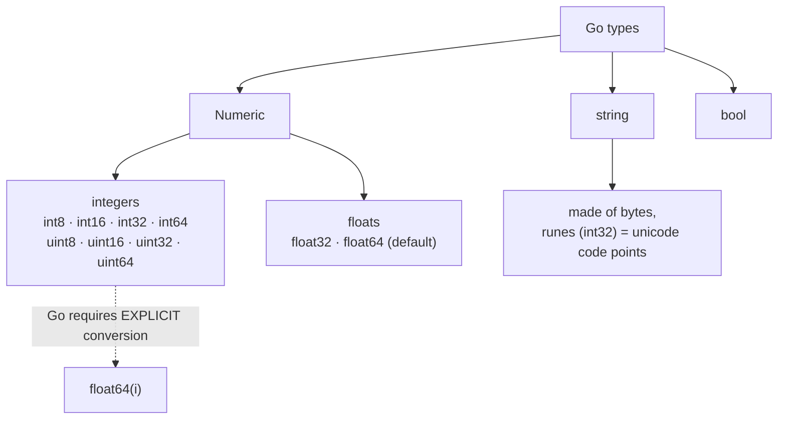

# Lesson 3: Data Types

## Big Picture



Go has **no implicit conversions** — mixing `int` and `float64` won't compile. Convert explicitly, always.

## Concepts

### Integer Types

| Type    | Size    | Range             |
|:--------|:--------|:------------------|
| `int8`  | 8 bits  | -128 to 127       |
| `int16` | 16 bits | -32768 to 32767   |
| `int32` | 32 bits | -2B to 2B         |
| `int64` | 64 bits | Very large        |
| `uint8` | 8 bits  | 0 to 255          |

### Floating Point
- `float32` — 32-bit precision
- `float64` — 64-bit precision (default)

### Strings
```go
s := "Hello"           // Regular string
m := `Multi
line`                  // Raw string literal
```

### Type Conversion
```go
i := 42
f := float64(i)  // Explicit conversion required
```

## Code Walkthrough

=== "Runnable example"

    ```go
    package main

    import "fmt"

    func main() {
        var i int = 42
        var f float64 = 3.14
        var b bool = true
        var s string = "hello"

        fmt.Println(i, f, b, s, len(s))
        fmt.Println(float64(i) * f) // explicit conversion
    }
    ```

!!! tip "Exercises"
    1. Declare an `int8` and try assigning 200 — what happens?
    2. Print the byte length vs rune count of a string containing an emoji.
    3. Convert a `float64` to `int` — where does the fractional part go?

## Check Your Understanding

<quiz>
Which conversion is REQUIRED in Go?
- [ ] `int` → `int64` (automatic)
- [x] `int` → `float64` (must write `float64(i)`)
- [ ] `string` → `string` 
- [ ] All conversions are implicit
</quiz>

<quiz>
A `rune` in Go is an alias for:
- [ ] `byte`
- [ ] `int8`
- [x] `int32`
- [ ] `string`
</quiz>
