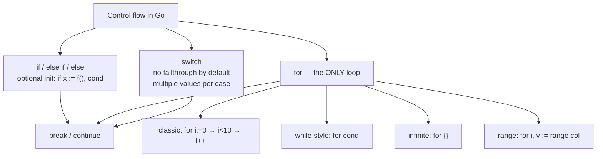

# Lesson 4: Control Flow

## Big Picture



Coming from Java/C? There is **no `while` or `do-while`** — `for` covers every looping need.

## Concepts

### If-Else
```go
if condition {
    // code
} else if anotherCondition {
    // code
} else {
    // code
}

// With initialization
if x := getValue(); x > 10 {
    // x is scoped to this if block
}
```

### Switch
```go
switch value {
case "a":
    // code
case "b", "c":
    // multiple values
default:
    // fallback
}
```

### For Loops
```go
// Traditional
for i := 0; i < 10; i++ { }

// While-style
for condition { }

// Infinite
for { break }

// Range
for index, value := range collection { }
```

## Code Walkthrough

=== "04_controlflow.go"

    ```go
    --8<-- "code/04_controlflow.go"
    ```

!!! example "Try it yourself"
    ```bash
    cd code
    go run . controlflow
    ```

!!! tip "Exercises"
    1. Write a `switch` with no condition (switch-true) to replace an if/else chain.
    2. Use `for range` on a string — what do you get for index and value?
    3. Write a loop that skips even numbers using `continue`.

## Check Your Understanding

<quiz>
Does Go `switch` fall through to the next case by default?
- [x] No — cases break automatically
- [ ] Yes — always
- [ ] Only with `default`
- [ ] Only inside functions
</quiz>

<quiz>
Which loop keywords exist in Go? (select all that are real Go syntax)
- [x] `for`
- [ ] `while`
- [ ] `do-while`
- [x] `for ... range`
</quiz>
