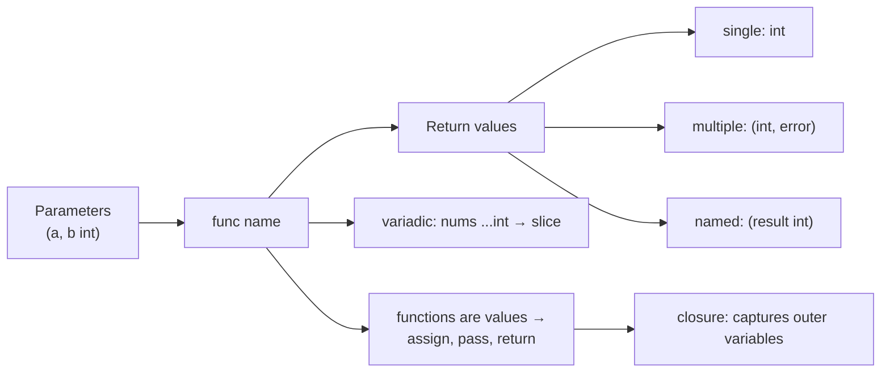

# Lesson 5: Functions

## Big Picture



Functions are **first-class citizens** — you can store them in variables, pass them as arguments, and return them. Closures carry their captured environment with them.

## Concepts

### Basic Function
```go
func greet(name string) {
    fmt.Println("Hello", name)
}
```

### Methods and Receivers

This syntax defines a **method with a pointer receiver**:

```go
func (m *Manager) AddEmployee(e Employee) {
    m.Employees = append(m.Employees, e)
}
```

Read the declaration from left to right:

- `func` declares a function or method.
- `(m *Manager)` is the **receiver**. It attaches the method to `Manager`, and `m` is the name used to access that value inside the method.
- `*Manager` is a **pointer receiver**, so the method can modify the original `Manager`.
- `AddEmployee` is the method name. Its capital letter makes it accessible from other packages when `Manager` is also exported.
- `(e Employee)` accepts one parameter named `e` of type `Employee`.
- There is no return type, so the method returns no value.
- `m.Employees` accesses the receiver's `Employees` field.
- `append(m.Employees, e)` returns a slice containing the new employee, which must be assigned back to `m.Employees`.

A complete example looks like this:

```go
package main

import "fmt"

type Employee struct {
    Name string
}

type Manager struct {
    Employees []Employee
}

func (m *Manager) AddEmployee(e Employee) {
    m.Employees = append(m.Employees, e)
}

func main() {
    manager := Manager{}
    manager.AddEmployee(Employee{Name: "Ava"})
    fmt.Println(manager.Employees[0].Name)
}
```

Use a pointer receiver when the method needs to modify the receiver or when copying the value would be expensive. A value receiver, such as `func (m Manager) EmployeeCount() int`, receives a copy and is suitable for small values that the method only reads.

Go automatically takes the address in `manager.AddEmployee(...)` when `manager` is addressable, so you usually do not need to write `(&manager).AddEmployee(...)`.

Go also does not require semicolons at the end of normal statements. Prefer `append(m.Employees, e)` rather than `append(m.Employees,e);` because `gofmt` follows the spaced, semicolon-free style.

### Return Values
```go
func add(a, b int) int {
    return a + b
}

// Multiple returns
func divide(a, b int) (int, error) {
    return a / b, nil
}

// Named returns
func calc() (result int) {
    result = 42
    return
}
```

### Variadic Functions
```go
func sum(nums ...int) int {
    total := 0
    for _, n := range nums {
        total += n
    }
    return total
}
```

### Closures
```go
func counter() func() int {
    count := 0
    return func() int {
        count++
        return count
    }
}
```

## Code Walkthrough

=== "Runnable example"

    ```go
    package main

    import "fmt"

    func divide(a, b int) (int, error) {
        if b == 0 {
            return 0, fmt.Errorf("divide by zero")
        }
        return a / b, nil
    }

    func sum(nums ...int) (total int) { // named return
        for _, n := range nums { total += n }
        return
    }

    func main() {
        fmt.Println(divide(10, 2))
        fmt.Println(sum(1, 2, 3))
    }
    ```

Full program: `code/05_functions.go`.

!!! example "Try it yourself"
    ```bash
    cd code
    go run . functions
    ```

!!! tip "Exercises"
    1. Write a variadic function `max(nums ...int) int` that returns the largest value.
    2. Return a function from a function — e.g., `func multiplier(factor int) func(int) int`.
    3. Rewrite a named-return function to use explicit returns. Which is clearer?

## Check Your Understanding

<quiz>
What does `func divide(a, b int) (int, error)` let Go do that Java can't (directly)?
- [ ] Overloading
- [x] Return multiple values
- [ ] Default parameters
- [ ] Generic types
</quiz>

<quiz>
Inside `func sum(nums ...int)`, what type is `nums`?
- [ ] `[]int` passed by pointer
- [x] `[]int` — a slice
- [ ] `int`
- [ ] `map[int]int`
</quiz>
