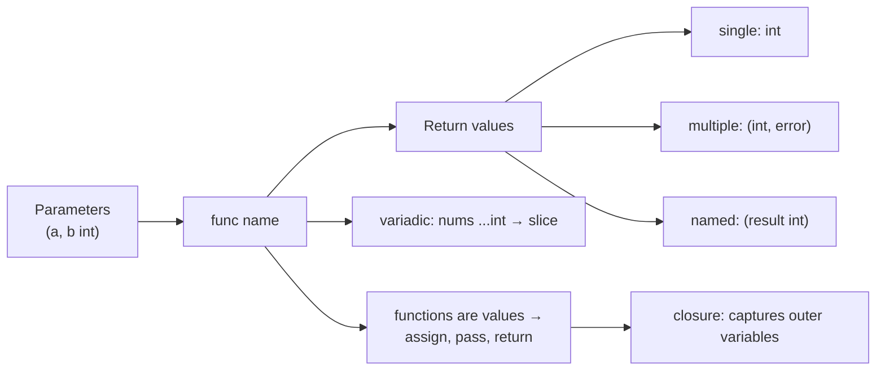

# Lesson 5: Functions

## Big Picture



Functions are **first-class citizens** — you can store them in variables, pass them as arguments, and return them. Closures carry their captured environment with them.

## Concepts

### Basic Function
```go
func greet(name string) {
    fmt.Println("Hello", name)
}
```

### Return Values
```go
func add(a, b int) int {
    return a + b
}

// Multiple returns
func divide(a, b int) (int, error) {
    return a / b, nil
}

// Named returns
func calc() (result int) {
    result = 42
    return
}
```

### Variadic Functions
```go
func sum(nums ...int) int {
    total := 0
    for _, n := range nums {
        total += n
    }
    return total
}
```

### Closures
```go
func counter() func() int {
    count := 0
    return func() int {
        count++
        return count
    }
}
```

## Code Walkthrough

=== "05_functions.go"

    ```go
    --8<-- "code/05_functions.go"
    ```

!!! example "Try it yourself"
    ```bash
    cd code
    go run . functions
    ```

!!! tip "Exercises"
    1. Write a variadic function `max(nums ...int) int` that returns the largest value.
    2. Return a function from a function — e.g., `func multiplier(factor int) func(int) int`.
    3. Rewrite a named-return function to use explicit returns. Which is clearer?

## Check Your Understanding

<quiz>
What does `func divide(a, b int) (int, error)` let Go do that Java can't (directly)?
- [ ] Overloading
- [x] Return multiple values
- [ ] Default parameters
- [ ] Generic types
</quiz>

<quiz>
Inside `func sum(nums ...int)`, what type is `nums`?
- [ ] `[]int` passed by pointer
- [x] `[]int` — a slice
- [ ] `int`
- [ ] `map[int]int`
</quiz>
