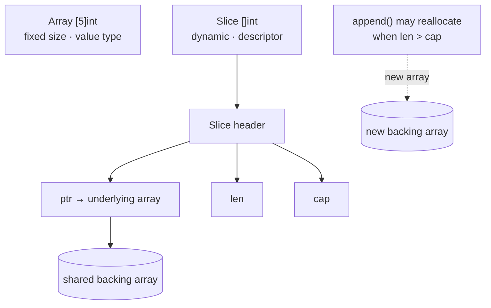

# Lesson 6: Arrays & Slices

## Big Picture



Slices are lightweight *views* over arrays — two slices can share the same backing array. `append` may silently switch you to a new array when capacity is exceeded, which is a classic source of bugs.

## Concepts

### Arrays (Fixed Size)
```go
var arr [5]int              // Zero initialized
arr := [3]string{"a", "b", "c"}
arr := [...]int{1, 2, 3}    // Compiler counts
```

### Slices (Dynamic)
```go
slice := []int{1, 2, 3}     // Slice literal
slice := make([]int, 5)     // Length 5
slice := make([]int, 3, 10) // Length 3, capacity 10
```

### Slice Operations
```go
slice = append(slice, 4)    // Add element
slice = append(s1, s2...)   // Append slice
copy(dest, src)             // Copy slices
```

### Slicing
```go
arr[1:3]  // Elements 1, 2
arr[:3]   // First 3 elements (0,1,2), excluding the index 3
arr[2:]   // From index 2 to end
arr[:]    // All elements
```

## Code Walkthrough

=== "Runnable example"

    ```go
    package main

    import "fmt"

    func main() {
        arr := [3]int{1, 2, 3}          // fixed size
        s := []int{1, 2, 3}             // dynamic view
        s = append(s, 4, 5)             // may reallocate
        fmt.Println(arr, s, len(s), cap(s))
        fmt.Println(s[1:3], s[:2])      // slicing
    }
    ```

Full program: `code/06_arrays_slices.go`.

!!! example "Try it yourself"
    ```bash
    cd code
    go run . slices
    ```

!!! tip "Exercises"
    1. Create a slice with `make([]int, 3, 10)`, then print `len` and `cap` before and after appends.
    2. Slice a slice (`s[1:3]`), mutate an element, and observe the original — why did it change?
    3. Write a function that removes element `i` from a slice using `append`.

## Check Your Understanding

<quiz>
What happens when `append` exceeds a slice's capacity?
- [ ] Runtime panic
- [ ] Data loss
- [x] A new, larger backing array is allocated
- [ ] Capacity grows by exactly 1
</quiz>

<quiz>
`s := arr[1:3]` — which elements does `s` contain?
- [ ] indexes 1, 2, 3
- [x] indexes 1 and 2
- [ ] index 1 only
- [ ] the last 3 elements
</quiz>
