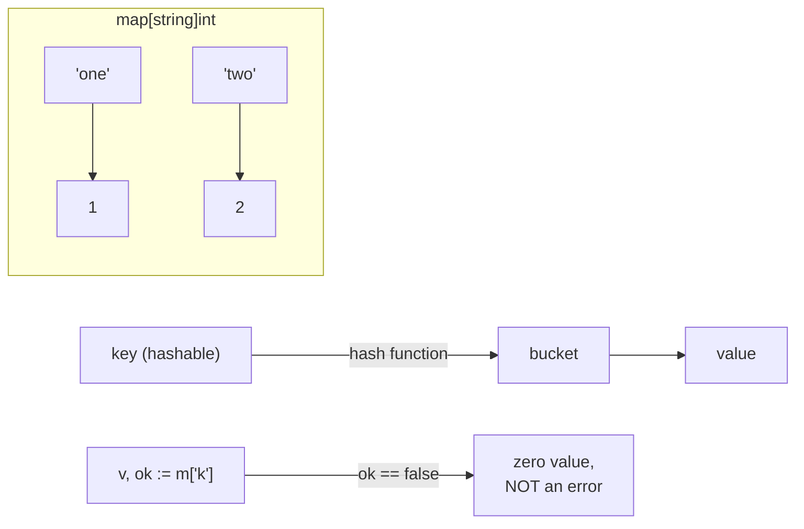

# Lesson 7: Maps

## Big Picture



Two idioms to memorize: `make(map[K]V)` (a `nil` map panics on write!) and the **comma-ok** pattern `v, ok := m[k]` to tell "absent" apart from "zero value".

## Concepts

### Creating Maps
```go
// Using make
m := make(map[string]int)

// Map literal
m := map[string]int{
    "one": 1,
    "two": 2,
}
```

### Operations
```go
m["key"] = value        // Set
value := m["key"]       // Get
delete(m, "key")        // Delete
len(m)                  // Length
```

### Check Key Exists
```go
value, ok := m["key"]
if ok {
    // key exists
}
```

### Iteration
```go
for key, value := range m {
    // process key, value
}
```

## Code Walkthrough

=== "07_maps.go"

    ```go
    --8<-- "code/07_maps.go"
    ```

!!! example "Try it yourself"
    ```bash
    cd code
    go run . maps
    ```

!!! tip "Exercises"
    1. Write a word-frequency counter: `map[string]int` over a slice of strings.
    2. Try writing to a `var m map[string]int` without `make` — what happens?
    3. Build a nested map `map[string]map[string]int` (e.g., city → metric → value).

## Check Your Understanding

<quiz>
`v := m["missing"]` on a `map[string]int` — what is `v`?
- [ ] Panic
- [ ] `nil`
- [x] `0` (the zero value)
- [ ] Random memory
</quiz>

<quiz>
How do you check if key `"k"` exists in map `m`?
- [ ] `m.exists("k")`
- [ ] `contains(m, "k")`
- [x] `v, ok := m["k"]; if ok { ... }`
- [ ] `m["k"] != nil`
</quiz>
