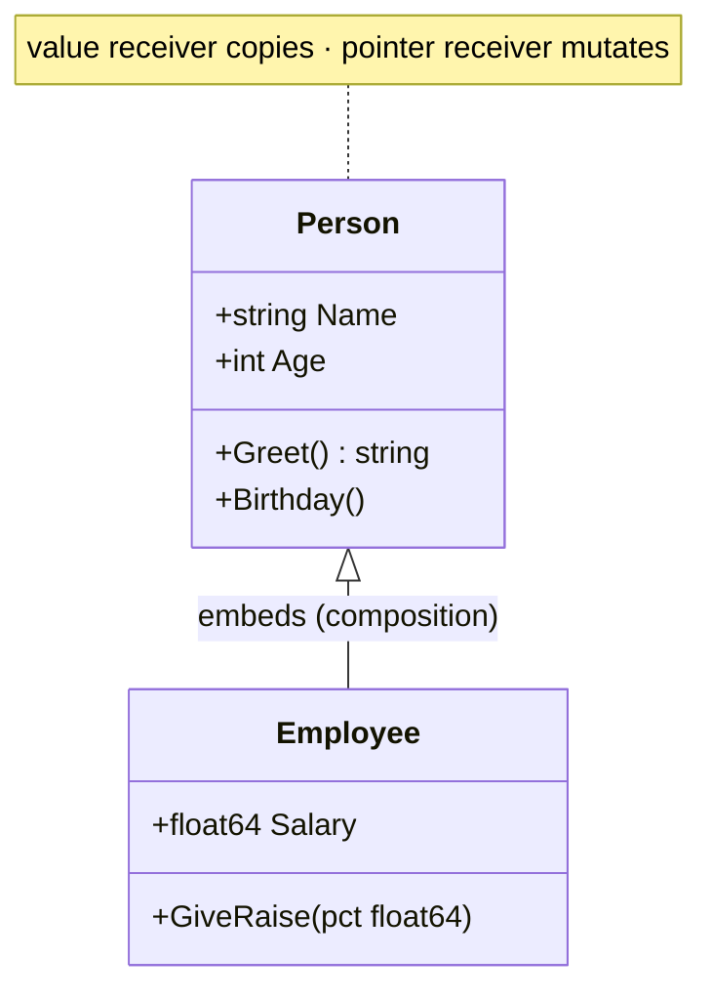

# Lesson 8: Structs

## Big Picture



Go has **no classes and no inheritance** — structs + methods + embedding give you composition instead. Use a pointer receiver when the method should mutate the struct (or to avoid copying a big struct).

## Concepts

### Defining Structs
```go
type Person struct {
    Name string
    Age  int
}
```

### Creating Instances
```go
p := Person{Name: "Alice", Age: 25}
p := Person{"Alice", 25}  // Positional
p := &Person{Name: "Bob"} // Pointer
```

### Methods
```go
// Value receiver
func (p Person) Greet() string {
    return "Hello, " + p.Name
}

// Pointer receiver (can modify)
func (p *Person) Birthday() {
    p.Age++
}
```

### Embedding
```go
type Employee struct {
    Person        // Embedded
    Salary float64
}
// emp.Name works (promoted)
```

## Code Walkthrough

=== "Runnable example"

    ```go
    package main

    import "fmt"

    type Person struct {
        Name string
        Age  int
    }

    func (p Person) Greet() string { return "Hi " + p.Name }
    func (p *Person) Birthday()    { p.Age++ } // mutates

    func main() {
        p := Person{Name: "Alice", Age: 30}
        fmt.Println(p.Greet())
        p.Birthday()
        fmt.Println(p.Age) // 31
    }
    ```

Full program: `code/08_structs.go`.

!!! example "Try it yourself"
    ```bash
    cd code
    go run . structs
    ```

!!! tip "Exercises"
    1. Add a `FullName()` method to a `Person` with `First`/`Last` fields.
    2. Embed `Person` in `Student` and call a promoted method.
    3. Write the same method with a value receiver vs pointer receiver — print the field after each call.

## Check Your Understanding

<quiz>
Which receiver type lets a method modify the struct it's called on?
- [ ] Value receiver `(p Person)`
- [x] Pointer receiver `(p *Person)`
- [ ] Both equally
- [ ] Neither — structs are immutable
</quiz>

<quiz>
What does embedding `Person` inside `Employee` give you?
- [ ] Inheritance with `super()`
- [x] Promoted fields/methods (composition)
- [ ] Private fields
- [ ] A compile error
</quiz>
