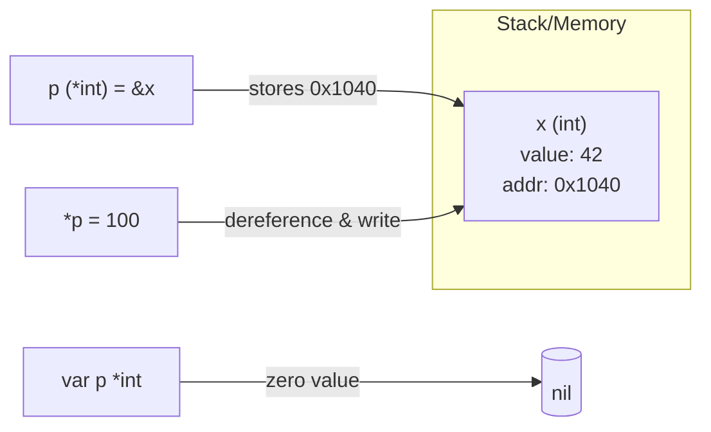

# Lesson 9: Pointers

## Big Picture



`&` takes an address, `*` dereferences it. Passing a pointer lets a function mutate the caller's value; passing a struct pointer avoids a copy. A `nil` pointer dereference panics.

## Concepts

### Pointer Basics
```go
x := 42
p := &x       // Get address
fmt.Println(*p) // Dereference (42)
*p = 100      // Modify through pointer
```

### Zero Value
```go
var p *int    // nil
p = new(int)  // Allocates, returns pointer
```

### Functions
```go
// Pass by reference
func modify(p *int) {
    *p = 100  // Changes original
}

num := 42
modify(&num)  // num is now 100
```

### Structs
```go
person := &Person{Name: "Alice"}
person.Name = "Bob"  // Auto-dereference
```

### When to Use
- Modify function parameters
- Avoid copying large structs
- Represent "no value" (nil)

## Code Walkthrough

=== "09_pointers.go"

    ```go
    --8<-- "code/09_pointers.go"
    ```

!!! example "Try it yourself"
    ```bash
    cd code
    go run . pointers
    ```

!!! tip "Exercises"
    1. Write `swap(a, b *int)` and verify both caller variables change.
    2. Print `&x` twice — does a variable's address stay stable?
    3. Dereference a nil pointer inside a controlled run — observe the panic.

## Check Your Understanding

<quiz>
What does `*p` mean when `p` is a `*int`?
- [ ] Address of `p`
- [x] Value stored at the address `p` points to
- [ ] Multiplication
- [ ] Pointer type declaration only
</quiz>

<quiz>
Go is pass-by-... what?
- [x] Pass-by-value (always — pointers are copied too)
- [ ] Pass-by-reference
- [ ] Pass-by-name
- [ ] Depends on the type
</quiz>
