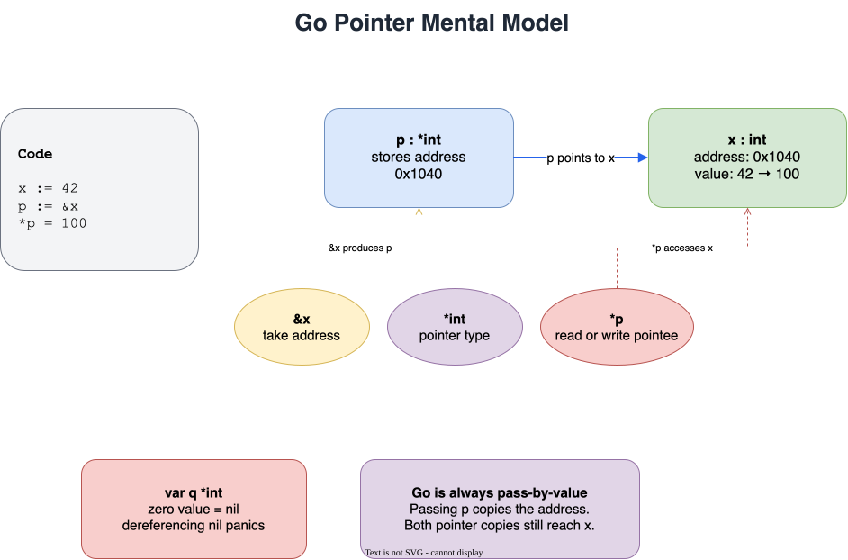
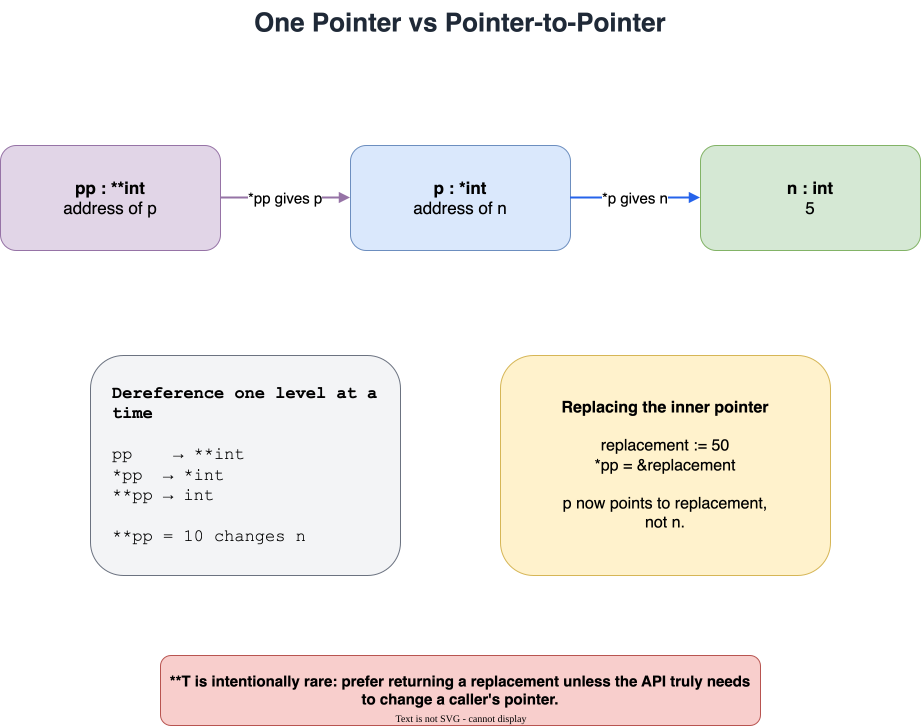
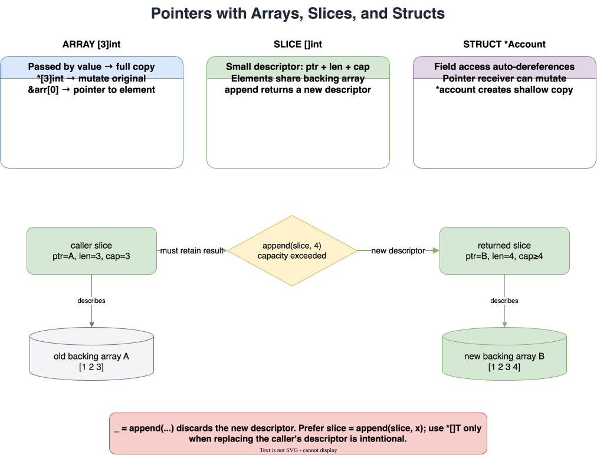
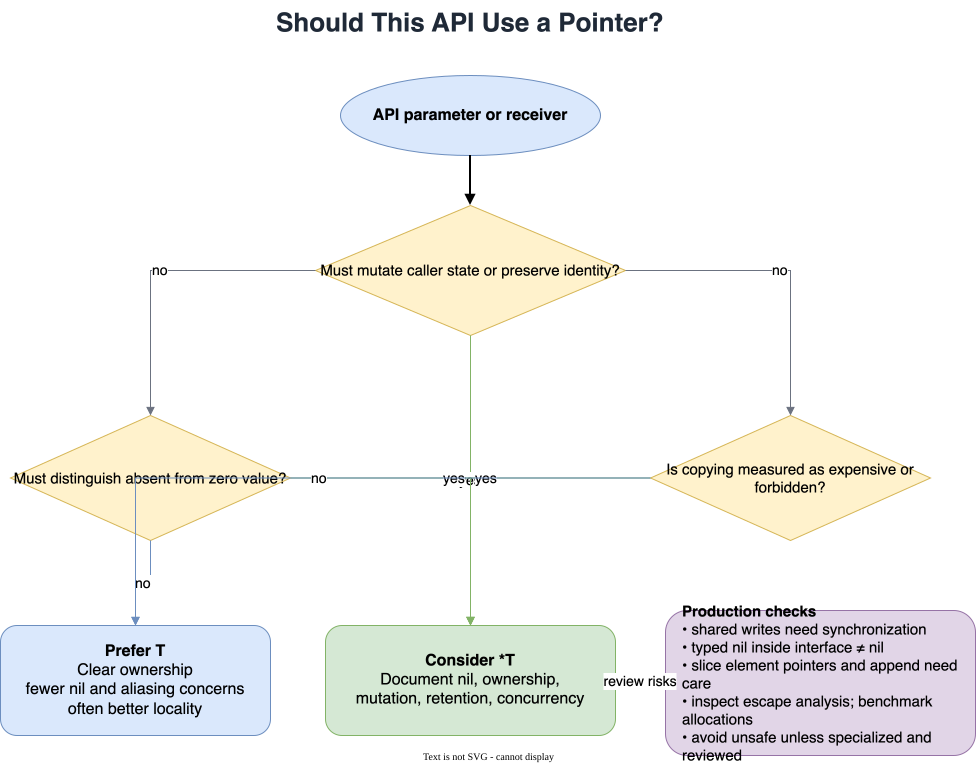

# Lesson 9: Pointers

## Big Picture



A pointer is a value that stores the address of another value. Go pointers support indirect access and mutation, but deliberately do not support normal pointer arithmetic. Go remains **pass-by-value**: when a pointer is passed to a function, the address itself is copied.

!!! info "Interactive draw.io source"
    Open the [Go pointers visual learning path](../diagrams/go-pointers-learning-path.drawio) to edit all four diagrams.

## Learning Path

1. Read `&`, `*T`, and `*p` correctly.
2. Understand `nil`, `new`, and safe dereferencing.
3. Pass pointers to functions when mutation is intentional.
4. Apply pointers to arrays, slices, structs, and methods.
5. Learn `**T`, interface typed-nil behavior, escape analysis, and concurrency concerns.

## 1. The Three Core Forms

The meaning of `*` depends on where it appears:

| Syntax | Read it as | Meaning |
|---|---|---|
| `&x` | address of `x` | Produces a pointer to `x` |
| `var p *int` | `p` is a pointer to `int` | Declares a pointer type |
| `*p` | value pointed to by `p` | Dereferences the pointer |

```go
x := 42
p := &x

fmt.Println(p)  // address such as 0x14000112018
fmt.Println(*p) // 42

*p = 100        // write through p
fmt.Println(x)  // 100
```

`p := &x` does not copy `x`; it stores the location of `x`. Copying `p` copies the address, so both pointers refer to the same value:

```go
q := p
*q = 200
fmt.Println(x, *p) // 200 200
```

## 2. `nil`, Dereferencing, and `new`

The zero value of every pointer type is `nil`, meaning it points to no value:

```go
var p *int
fmt.Println(p == nil) // true
```

Dereferencing `nil` with `*p` causes a runtime panic. Check for `nil` when it is a valid input state:

```go
if p != nil {
    fmt.Println(*p)
}
```

`new(T)` allocates a zero-valued `T` and returns `*T`:

```go
p := new(int)
fmt.Println(*p) // 0
*p = 7
```

In ordinary Go, a local variable plus `&` is often clearer:

```go
value := 7
p := &value
```

## 3. Functions: Go Is Always Pass-by-Value

A non-pointer argument is copied, so changing the parameter does not change the caller:

```go
func doubleValue(n int) {
    n *= 2
}
```

A pointer argument is also copied, but the copied address still points to the caller's value:

```go
func doublePointer(n *int) {
    if n != nil {
        *n *= 2
    }
}

number := 10
doublePointer(&number)
fmt.Println(number) // 20
```

Avoid describing this as “pass-by-reference.” The precise model is **a pointer passed by value**.

### Returning a Pointer Is Safe

Go may move a local value to the heap when it must outlive the function. This is called escape analysis:

```go
func newInt(value int) *int {
    return &value
}
```

This is safe; Go does not return a dangling pointer here. Inspect compiler decisions when performance matters:

```bash
go build -gcflags="-m" ./code
```

Do not design APIs around guesses about stack versus heap placement. Measure allocations with benchmarks and profiles.

## 4. Pointer to Pointer: `**T`



`**int` means “pointer to a pointer to an integer”:

```go
n := 5
p := &n
pp := &p

fmt.Println(**pp) // 5
**pp = 10         // changes n
```

Each `*` follows one pointer level:

- `pp` has type `**int`.
- `*pp` has type `*int` and is the same pointer as `p`.
- `**pp` has type `int` and accesses `n`.

A pointer-to-pointer can replace where another pointer points:

```go
replacement := 50
*pp = &replacement
fmt.Println(*p) // 50
```

`**T` is uncommon in idiomatic application code. It appears in low-level APIs, interop, data structures, or functions that must replace a caller's pointer. Prefer returning the replacement when that makes the API clearer.

## 5. Arrays and Pointers



An array `[N]T` is a value. Passing it to a function copies all elements:

```go
func modifyCopy(values [3]int) {
    values[0] = 999
}
```

Use `*[N]T` to mutate the original array without copying it:

```go
func modifyOriginal(values *[3]int) {
    if values != nil {
        values[0] = 999
    }
}

values := [3]int{1, 2, 3}
modifyOriginal(&values)
```

You can also point to one array element:

```go
first := &values[0]
*first = 111
```

In most APIs, a slice is more flexible than a pointer to an array. Pointer-to-array types are useful when the exact length is part of the contract or when working with fixed-size buffers.

## 6. Slices: Usually Do Not Use `*[]T`

A slice is already a small descriptor containing a pointer to an underlying array, a length, and a capacity. Passing `[]T` copies the descriptor, but both copies initially refer to the same backing array.

### Mutating Existing Elements

A plain slice is enough to modify elements:

```go
func setFirst(values []int) {
    if len(values) > 0 {
        values[0] = 999
    }
}
```

### Appending Changes the Descriptor

`append` returns a new slice descriptor and may allocate a new backing array. The caller must retain the result:

```go
func addNumber(values []int, number int) []int {
    return append(values, number)
}

values = addNumber(values, 4)
```

A pointer to a slice can replace the caller's descriptor:

```go
func addNumberInPlace(values *[]int, number int) {
    if values != nil {
        *values = append(*values, number)
    }
}

addNumberInPlace(&values, 5)
```

The return-value style is usually more idiomatic because it makes the change visible at the call site.

This is wrong even though it compiles:

```go
_ = append(*values, number)
```

`_` is the blank identifier, so the updated descriptor is discarded. The caller's slice length is not updated.

## 7. Struct Pointers and Automatic Dereferencing

Use `&T{...}` to construct a value and take its address:

```go
type Account struct {
    Owner   string
    Balance int
}

account := &Account{Owner: "Alice", Balance: 100}
```

Go automatically dereferences struct pointers for field selection:

```go
account.Balance = 150

// Equivalent, but unnecessarily noisy:
(*account).Balance = 150
```

Dereferencing and assigning to another variable makes a struct copy:

```go
copyOfAccount := *account
copyOfAccount.Owner = "Another owner"
```

Be aware that this is only a shallow copy. Pointer, slice, and map fields inside the struct may still share underlying data.

## 8. Value Receivers vs Pointer Receivers

```go
func (a Account) Summary() string {
    return fmt.Sprintf("%s has %d", a.Owner, a.Balance)
}

func (a *Account) Deposit(amount int) {
    if a != nil {
        a.Balance += amount
    }
}
```

Use a pointer receiver when the method:

- Mutates the receiver.
- Operates on a large struct where copying is meaningfully expensive.
- Must preserve identity or contains fields that must not be copied, such as `sync.Mutex`.

Use a value receiver for small, immutable value-like types. Keep receiver choice consistent across a type unless there is a clear reason not to.

Go may automatically take an address for an addressable value:

```go
account := Account{}
account.Deposit(10) // treated like (&account).Deposit(10)
```

A map element is not addressable, so a pointer-receiver mutation cannot be called directly on `map[K]T` elements. Store pointers (`map[K]*T`) or retrieve, modify, and assign the value back.

### Method Sets and Interfaces

Methods with receiver `T` belong to the method sets of both `T` and `*T`. Methods with receiver `*T` belong only to the method set of `*T`. Therefore, an interface requiring a pointer-receiver method may be implemented by `*T` but not by `T`.

## 9. Collections of Pointers

To retain pointers to slice elements, take addresses by index:

```go
accounts := []Account{{Owner: "A"}, {Owner: "B"}}
for i := range accounts {
    account := &accounts[i]
    account.Balance = 100
}
```

A `[]*T` or `map[K]*T` provides shared identity and allows mutation, but introduces possible `nil` entries and aliasing. A `[]T` or `map[K]T` often gives simpler ownership and better memory locality.

Pointers into a slice's backing array can become stale relative to the slice after `append` reallocates it. The pointer still refers to the old allocation, not necessarily the corresponding element in the new backing array. Avoid retaining element pointers across operations that may grow the slice.

## 10. Maps, Channels, Functions, and Interfaces

Maps, channels, functions, and slices already contain internal references. Pointers to them are rarely needed:

```go
func update(m map[string]int) {
    m["count"]++
}
```

Use `*map[K]V`, `*chan T`, or `*func(...)` only when you specifically need to replace the caller's descriptor or distinguish additional states. Returning a replacement is often clearer.

### The Typed-`nil` Interface Trap

An interface is `nil` only when both its dynamic type and dynamic value are absent:

```go
var account *Account
var value any = account

fmt.Println(account == nil) // true
fmt.Println(value == nil)   // false
```

`value` contains the dynamic type `*Account` and a nil dynamic value. This commonly causes bugs when typed nil pointers are returned as `error` or another interface. Return a literal `nil` interface when there is no value.

## 11. Production-Level Guidance



### Prefer Values by Default

Values reduce aliasing, make ownership clearer, and are often cheap. Use pointers when at least one is true:

- Mutation of the caller's value is part of the API.
- Identity or shared state matters.
- `nil` represents a meaningful “not present” state.
- Copying is measured to be expensive.
- The type contains non-copyable synchronization state.

Do not use a pointer only to save a few bytes. Pointer-heavy object graphs can increase garbage-collector work and reduce cache locality.

### Optional Values

A `*T` can distinguish “absent” (`nil`) from the zero value of `T`, which is useful in patches, configuration, and serialization. Do not use pointers for every field automatically; they increase nil handling and aliasing complexity.

### Ownership and Aliasing

Document whether a function stores a pointer after returning, mutates through it, or merely reads it during the call. Callers need this to reason about lifetime and concurrent access.

### Concurrency

A pointer does not make access thread-safe. If multiple goroutines can read and write the pointed-to value, synchronize access with a mutex, channel, atomic operation, or ownership transfer. Validate with:

```bash
go test -race ./...
```

### Nil Receiver Policy

Go permits calling a method with a nil pointer receiver, but the method must handle `nil` before dereferencing. Choose and document whether nil receivers are supported. Do not add nil checks blindly when nil indicates a programmer error.

### Escape Analysis and Allocation

Returning or storing a pointer may cause its target to escape to the heap, but compiler decisions vary. A pointer does not guarantee heap allocation, and a value does not guarantee stack allocation. Use compiler diagnostics, benchmarks, and profiles rather than assumptions.

### No Pointer Arithmetic

Safe Go does not support arithmetic such as `p + 1`. Index arrays and slices instead. The `unsafe` package can bypass type and memory-safety guarantees and can break across compiler or runtime changes. Restrict it to specialized, reviewed code with tests and benchmarks.

### API Review Checklist

Before adding a pointer to an API, ask:

1. Is mutation intentional and obvious to the caller?
2. Is `nil` valid, and what does it mean?
3. Could returning a value be clearer?
4. Will the pointer be retained after the function returns?
5. Can multiple goroutines access the target?
6. Does copying the value contain a mutex or other no-copy state?
7. Have allocation or copy costs actually been measured?

## Code Walkthrough

=== "Runnable example"

    ```go
    package main

    import "fmt"

    func addViaPtr(s *[]int, n int) { *s = append(*s, n) }

    func main() {
        x := 42
        p := &x
        *p = 100                 // write through pointer

        pp := &p
        **pp = 55                // two levels of indirection

        s := []int{1, 2}
        s[0] = 99                // elements shared — no pointer needed
        addViaPtr(&s, 3)         // *[]int replaces the slice header

        fmt.Println(x, *p, **pp, s)
    }
    ```

Full program: `code/09_pointers.go`.

!!! example "Try it yourself"
    ```bash
    cd code
    go run . pointers
    ```

!!! tip "Exercises"
    1. Write `swap(a, b *int)` and verify both caller variables change.
    2. Add a nil check to a function taking `*int`, then call it with `nil`.
    3. Compare array mutation through `[3]int` and `*[3]int`.
    4. Append to a `[]int` without returning it, then fix the function.
    5. Build a `**int`, change the final integer, then replace the inner pointer.
    6. Create an interface holding a typed nil pointer and explain why it is not nil.
    7. Run escape analysis and identify which values escape.
    8. Write a deliberately shared counter and use `go test -race` to detect its race before synchronizing it.

## Check Your Understanding

<quiz>
What does `*p` mean when `p` is a `*int`?
- [ ] Address of `p`
- [x] Value stored at the address `p` points to
- [ ] Multiplication only
- [ ] A new allocation
</quiz>

<quiz>
Go is pass-by-... what?
- [x] Pass-by-value, including pointer values
- [ ] Pass-by-reference
- [ ] Pass-by-name
- [ ] Determined by the parameter type
</quiz>

<quiz>
Why must the result of `append` normally be retained?
- [ ] `append` always clears the original slice
- [x] It returns an updated slice descriptor and may use a new backing array
- [ ] A slice cannot contain pointers
- [ ] `append` returns an error
</quiz>

<quiz>
When is an interface containing a nil `*T` equal to nil?
- [ ] Always
- [ ] Only when `T` is a struct
- [x] It is not nil because the interface still has a dynamic type
- [ ] Only after dereferencing it
</quiz>
