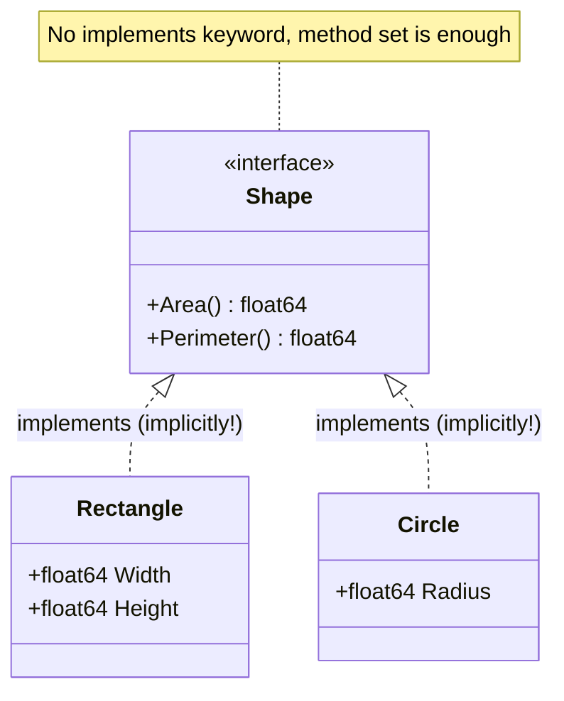

# Lesson 10: Interfaces

## Big Picture



Interfaces are satisfied **implicitly** — if a type has the methods, it *is* the interface. This decouples definition from usage and is the foundation of Go's `io.Reader`, `error`, and `fmt.Stringer` idioms.

## Concepts

### Defining Interfaces
```go
type Shape interface {
    Area() float64
    Perimeter() float64
}
```

### Implementing (Implicit)
```go
type Rectangle struct {
    Width, Height float64
}

func (r Rectangle) Area() float64 {
    return r.Width * r.Height
}

func (r Rectangle) Perimeter() float64 {
    return 2 * (r.Width + r.Height)
}
// Rectangle now implements Shape
```

### Type Assertion
```go
var s Shape = Rectangle{}
r, ok := s.(Rectangle)
if ok {
    // r is Rectangle
}
```

### Type Switch
```go
switch v := s.(type) {
case Rectangle:
    // v is Rectangle
case Circle:
    // v is Circle
}
```

### Empty Interface
```go
var anything interface{}
anything = 42
anything = "hello"
// Or use 'any' (Go 1.18+)
```

## Code Walkthrough

=== "Runnable example"

    ```go
    package main

    import "fmt"

    type Speaker interface{ Speak() string }

    type Dog struct{}
    func (Dog) Speak() string { return "woof" }

    func say(s Speaker) { fmt.Println(s.Speak()) }

    func main() {
        say(Dog{})

        var v any = 42            // empty interface
        if n, ok := v.(int); ok { // type assertion
            fmt.Println("int:", n)
        }
    }
    ```

Full program: `code/10_interfaces.go`.

!!! example "Try it yourself"
    ```bash
    cd code
    go run . interfaces
    ```

!!! tip "Exercises"
    1. Add a `Triangle` type that satisfies `Shape` — notice you didn't modify `Shape`.
    2. Write a `type switch` over `any` that handles `int`, `string`, and `[]byte`.
    3. Implement `fmt.Stringer` (`String() string`) on a struct and `Println` it.

## Check Your Understanding

<quiz>
How does a Go type declare that it implements an interface?
- [ ] `implements Shape`
- [ ] `extends Shape`
- [x] It doesn't — implementing the method set is enough
- [ ] `type Rect : Shape`
</quiz>

<quiz>
What is the modern alias for `interface{}` (Go 1.18+)?
- [ ] `object`
- [x] `any`
- [ ] `void`
- [ ] `generic`
</quiz>
