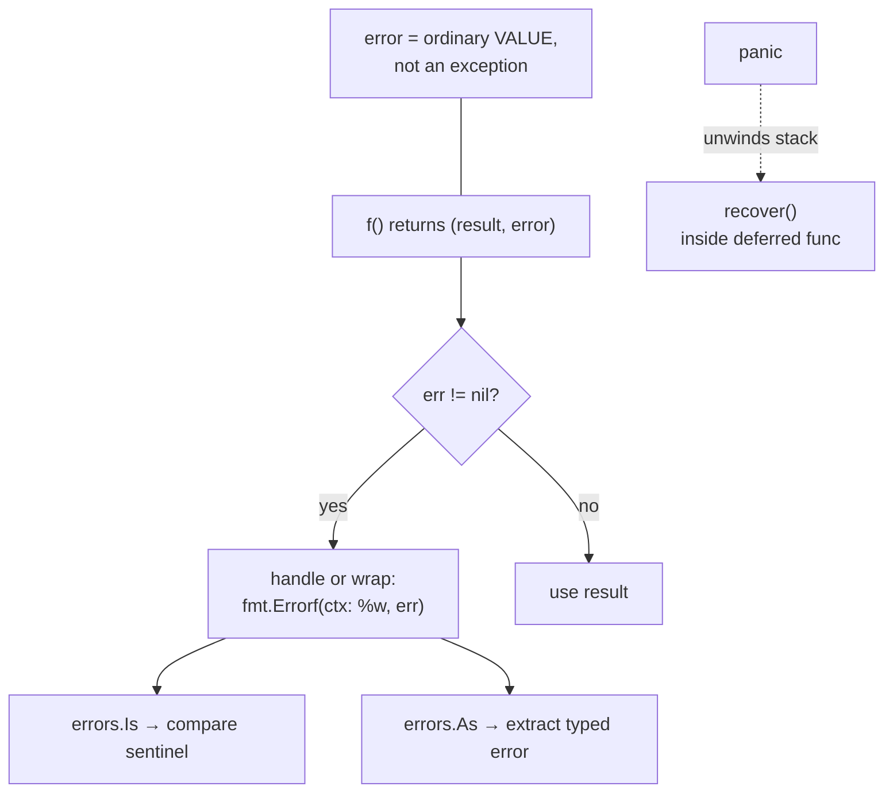

# Lesson 11: Error Handling

## Big Picture



Errors are **values, not exceptions**. `if err != nil` is verbose on purpose — it forces you to decide at each failure point. Reserve `panic`/`recover` for truly unrecoverable programmer errors.

## Concepts

### Basic Error Handling
```go
result, err := someFunction()
if err != nil {
    // Handle error
    return err
}
// Use result
```

### Creating Errors
```go
// Simple error
err := errors.New("something went wrong")

// Formatted error
err := fmt.Errorf("failed to process %s", item)
```

### Custom Error Types
```go
type MyError struct {
    Code    int
    Message string
}

func (e *MyError) Error() string {
    return e.Message
}
```

### Error Wrapping
```go
// Wrap error with context
return fmt.Errorf("operation failed: %w", err)

// Check wrapped errors
if errors.Is(err, SomeError) { }
if errors.As(err, &myErr) { }
```

### Defer and LIFO Order

A `defer` statement schedules a function call to run when the surrounding function is about to return. If a function schedules multiple deferred calls, Go executes them in **LIFO (Last In, First Out)** order: the last call deferred is the first one run. This stack-like behavior is useful when resources must be cleaned up in the reverse order in which they were acquired.

```go
func deferredCalls() {
    defer fmt.Println("first")
    defer fmt.Println("second")
    defer fmt.Println("third")
}

// Output when deferredCalls returns:
// third
// second
// first
```

### Panic and Recover

A deferred function can call `recover` to stop a panic while the stack is unwinding.

```go
defer func() {
    if r := recover(); r != nil {
        // Handle panic
    }
}()
panic("critical error")
```

## Code Walkthrough

=== "11_errors.go"

    ```go
    --8<-- "code/11_errors.go"
    ```

!!! example "Try it yourself"
    ```bash
    cd code
    go run . errors
    ```

!!! tip "Exercises"
    1. Define a sentinel `var ErrNotFound = errors.New("not found")`, wrap it, then detect it with `errors.Is`.
    2. Create a custom error type carrying a status code and extract it with `errors.As`.
    3. Write a function that panics, and recover from it in `main` via `defer`.

## Check Your Understanding

<quiz>
What does the `%w` verb in `fmt.Errorf` do?
- [ ] Writes the error to stdout
- [x] Wraps the error so `errors.Is`/`As` can unwrap it
- [ ] Formats width
- [ ] Warns instead of erroring
</quiz>

<quiz>
Where can `recover()` actually catch a panic?
- [ ] Anywhere in the same function
- [x] Inside a deferred function
- [ ] In `main` only
- [ ] Inside `init()`
</quiz>
