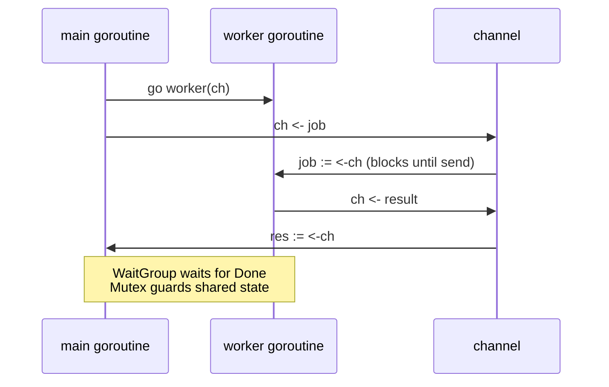

# Lesson 12: Concurrency

## Big Picture



**Goroutines** are cheap threads managed by the Go runtime; **channels** let them communicate safely — "don't communicate by sharing memory; share memory by communicating." `select` multiplexes channel ops; `WaitGroup`/`Mutex` cover the cases channels don't.

## Concepts

### Goroutines
```go
go myFunction()     // Start goroutine
go func() { }()     // Anonymous goroutine
```

### Channels
```go
ch := make(chan int)      // Unbuffered
ch := make(chan int, 10)  // Buffered

ch <- value   // Send
value := <-ch // Receive
close(ch)     // Close
```

### Select
```go
select {
case msg := <-ch1:
    // Handle ch1
case ch2 <- value:
    // Send to ch2
case <-time.After(time.Second):
    // Timeout
default:
    // Non-blocking
}
```

### Synchronization
```go
// WaitGroup
var wg sync.WaitGroup
wg.Add(1)
go func() {
    defer wg.Done()
    // work
}()
wg.Wait()

// Mutex
var mu sync.Mutex
mu.Lock()
// critical section
mu.Unlock()
```

## Code Walkthrough

=== "12_concurrency.go"

    ```go
    --8<-- "code/12_concurrency.go"
    ```

!!! example "Try it yourself"
    ```bash
    cd code
    go run . concurrency
    ```

!!! warning "Race conditions"
    Run with the race detector to flag unsynchronized shared access:
    ```bash
    go run -race . concurrency
    ```

!!! tip "Exercises"
    1. Write a worker pool: N goroutines read jobs from one channel.
    2. Add a `time.After` timeout to a `select` receiving from a slow channel.
    3. Build a counter incremented by 1000 goroutines — once unsynchronized (watch it fail with `-race`), then with a `Mutex`, then with a channel.

## Check Your Understanding

<quiz>
What does an unbuffered channel send `ch <- v` do if no one is receiving?
- [ ] Drops the value
- [x] Blocks until a receiver is ready
- [ ] Panics immediately
- [ ] Buffers internally
</quiz>

<quiz>
Which tools prevent goroutine races? (select all)
- [x] `sync.Mutex`
- [x] channels
- [ ] `sync.WaitGroup` (waits for completion — doesn't guard data)
- [ ] `time.Sleep`
</quiz>
