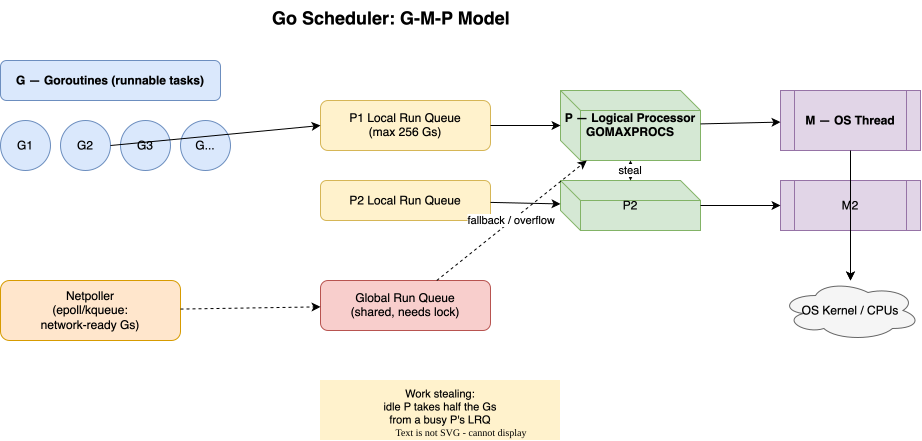

# 13 · Concurrency Deep Dive (Interview Level)

You know `go func()`. Interviews test whether you know *why* it's fast and *where* it breaks.

## The GMP Scheduler



[:material-drawing: Editable draw.io source](../diagrams/go-scheduler-gmp.drawio) — open in draw.io Desktop to tweak.

### What interviews actually ask

| Question | The answer they're fishing for |
|:--|:--|
| Goroutine vs Java thread? | ~KB stacks vs ~1MB; runtime-scheduled (M:N), not OS-scheduled; no heavyweight context switch |
| What is `GOMAXPROCS`? | Number of Ps — max OS threads executing Go code *simultaneously*. Default = CPU count |
| How does a blocking syscall work? | M detaches from P and blocks in the kernel; another M picks up the P and keeps running Gs |
| Network I/O blocking? | Doesn't block an M — goes through the **netpoller** (epoll/kqueue), G is parked and rescheduled |
| Preemption? | Since Go 1.14: async preemption — a tight `for {}` can no longer starve the scheduler |

## Channels — beyond basics

```go
ch := make(chan int)     // unbuffered: send blocks until receive (rendezvous)
ch := make(chan int, 3)  // buffered: blocks only when full
```

- `nil` channel: send and receive **block forever** — used to disable a `select` case by setting it to nil.
- Receive from closed channel: zero value, `ok == false`. **Send** to closed channel: panic.
- `for v := range ch` exits when channel is closed — idiom for "work queue drained".
- Who closes? **The sender**, never the receiver (receiver can't know if more senders exist).

## `select`

```go
select {
case v := <-ch1:        // receive
case ch2 <- v:          // send
case <-ctx.Done():      // cancellation (the idiomatic timeout)
case <-time.After(t):   // timeout — leaks the timer in a loop! use time.NewTimer
default:                // non-blocking
}
// Multiple ready cases → chosen uniformly at RANDOM (not first-ready)
```

## context.Context — the interview favorite

```go
ctx, cancel := context.WithTimeout(parent, 2*time.Second)
defer cancel()              // ALWAYS call — leaks a timer + goroutine otherwise
```

- Immutable tree: `WithCancel`, `WithTimeout`, `WithDeadline`, `WithValue`.
- Pass as **first param** `ctx context.Context`; never store in a struct (controversial but standard advice).
- `ctx.Err()` → `context.Canceled` or `context.DeadlineExceeded`.
- `WithValue` is for request-scoped data (trace IDs), **not** optional function params — interviewers probe this.

## Synchronization — when channels aren't right

| Tool | Use when |
|:--|:--|
| `sync.Mutex` / `RWMutex` | Protecting shared state; RWMutex when reads ≫ writes |
| `sync.WaitGroup` | Wait for N goroutines to finish |
| `sync.Once` | Lazy one-time init (singleton) |
| `sync.Map` | Rare: write-once-read-many caches; usually plain map+RWMutex wins |
| `atomic.*` | Single counters/flags; lock-free |
| `errgroup` | Fan-out/fan-in with first-error cancellation + `Wait()` |

## Classic interview questions

!!! question "Why does this print the same value?"
    ```go
    for i := 0; i < 3; i++ {
        go func() { fmt.Println(i) }()   // closure captures i
    }
    ```
    Loop variable capture. Pre-1.22 fix: pass `i` as a param. **Go 1.22+ fixed it** — each iteration gets a fresh `i`. Know both.

!!! question "Unbuffered channel send with no receiver — what happens?"
    Sender blocks forever → **goroutine leak**. The goroutine never dies, GC can't collect it. Fix: buffered channel, `select`+`ctx.Done()`, or always ensure a receiver.

!!! question "Detect a data race?"
    `go run -race` / `go test -race`. Detector instruments memory access; ~5-10x slowdown, run in CI not prod.

!!! question "`time.After` in a hot loop?"
    Leaks a timer per iteration until it fires. Use `time.NewTimer` + `Stop()`, or restructure with `select`.

!!! question "How to limit concurrency on 10k tasks?"
    Semaphore pattern: buffered channel `sem := make(chan struct{}, 64)`; `sem <- struct{}{}` before work, `<-sem` after. Or `errgroup` + `SetLimit(64)`.

## Check Your Understanding

<quiz>
A goroutine making a blocking network read…
- [ ] Blocks its OS thread
- [x] Is parked by the netpoller; its M stays free via the P
- [ ] Blocks the whole program
- [ ] Panics
</quiz>

<quiz>
Sending on a closed channel causes:
- [ ] Silent drop
- [ ] Return of zero value
- [x] panic
- [ ] Deadlock detected error
</quiz>

<quiz>
`select` with two ready cases picks:
- [ ] The first case written
- [ ] The first that became ready
- [x] Uniformly at random
- [ ] Both, in order
</quiz>
