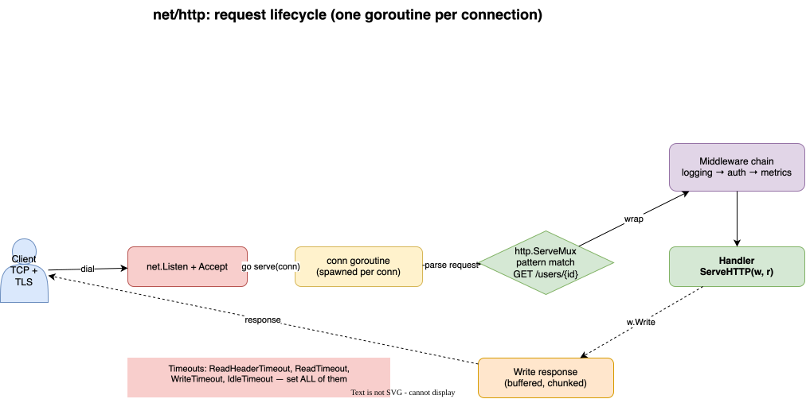

# 14 · net/http — The Standard Library Server

Go's `net/http` is production-grade — knowing it cold is itself an interview signal. Chi and Gin are thin layers on top of it.

## Request lifecycle



[:material-drawing: Editable draw.io source](../diagrams/http-request-flow.drawio) — open in draw.io Desktop to tweak.

## The two interfaces that are everything

```go
type Handler interface {
    ServeHTTP(ResponseWriter, *Request)
}

// HandlerFunc — adapter so a plain func satisfies Handler (like Java's
// functional interface + lambda)
type HandlerFunc func(ResponseWriter, *Request)
```

```go
mux := http.NewServeMux()

// Go 1.22+ method+wildcard patterns (this removed most reasons for a router)
mux.HandleFunc("GET /users/{id}", getUser)        // r.PathValue("id")
mux.HandleFunc("POST /users", createUser)
mux.Handle("/admin/", http.StripPrefix("/admin", adminMux))

http.ListenAndServe(":8080", mux)   // convenience — for prod, build a Server
```

## Middleware = function composition

```go
func logging(next http.Handler) http.Handler {
    return http.HandlerFunc(func(w http.ResponseWriter, r *http.Request) {
        start := time.Now()
        next.ServeHTTP(w, r)
        log.Printf("%s %s %s", r.Method, r.URL.Path, time.Since(start))
    })
}

mux := http.NewServeMux()
// compose: logging(recoverer(mux))
http.ListenAndServe(":8080", logging(mux))
```

No framework needed — middleware is just `func(Handler) Handler`.

## Production-grade server (memorize this)

```go
srv := &http.Server{
    Addr:              ":8080",
    Handler:           logging(mux),
    ReadHeaderTimeout: 5 * time.Second,   // Slowloris defense
    ReadTimeout:       10 * time.Second,
    WriteTimeout:      10 * time.Second,
    IdleTimeout:       60 * time.Second,
    MaxHeaderBytes:    1 << 20,
}

// Graceful shutdown
go func() {
    sig := make(chan os.Signal, 1)
    signal.Notify(sig, syscall.SIGINT, syscall.SIGTERM)
    <-sig
    ctx, cancel := context.WithTimeout(context.Background(), 10*time.Second)
    defer cancel()
    srv.Shutdown(ctx)   // drains in-flight requests
}()

srv.ListenAndServe()
```

## Client side

```go
client := &http.Client{Timeout: 5 * time.Second}  // Default client has NO timeout!

resp, err := client.Get(url)
defer resp.Body.Close()               // ALWAYS — leaks connection otherwise
body, err := io.ReadAll(resp.Body)

// Reuse transports for pooling; don't create a Client per request
```

## Interview questions

!!! question "Is `http.ListenAndServe(":8080", nil)` safe in prod?"
    Two problems: `nil` uses `DefaultServeMux` (package-level, anything imported can register routes — security smell) **and** no timeouts → Slowloris vulnerable. Always build an explicit `http.Server`.

!!! question "What happens if you forget `resp.Body.Close()`?"
    The TCP connection can't be returned to the pool → connection leak, eventual `too many open files`. Reading the body to EOF also matters for keep-alive reuse.

!!! question "Concurrency model of the stdlib server?"
    One goroutine per connection (plus HTTP/2 streams multiplexed on it). No thread pool to tune — the scheduler handles it. This is why Go servers handle 100k+ conns trivially.

!!! question "`Handler` vs `HandlerFunc` — what's the trick?"
    `HandlerFunc` is a function type with a `ServeHTTP` method — the adapter pattern. Same idea as Java's `Function` interfaces, but in Go it's just a named func type.

<quiz>
`mux.HandleFunc("GET /users/{id}", h)` — how do you read `id`?
- [ ] `r.URL.Query().Get("id")`
- [x] `r.PathValue("id")`
- [ ] `mux.Param("id")`
- [ ] Parsing `r.URL.Path` manually
</quiz>

<quiz>
Go middleware is implemented as:
- [ ] An `Interceptor` interface
- [ ] A decorator base class
- [x] `func(http.Handler) http.Handler` composition
- [ ] Annotations on handlers
</quiz>
