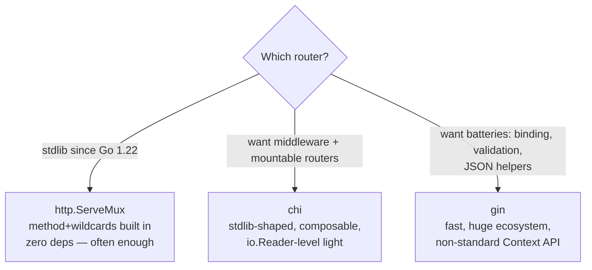

# 15 · Routers: chi vs gin vs stdlib

## Landscape (2024+ reality)



| | stdlib `ServeMux` (1.22+) | chi | gin |
|:--|:--|:--|:--|
| Path params | `r.PathValue("id")` | `chi.URLParam(r,"id")` | `c.Param("id")` |
| Middleware | compose yourself | `r.Use(mw)`, stdlib signature | `engine.Use`, `*gin.Context` |
| Handler signature | `(w, r)` — standard | `(w, r)` — **standard** | `(c *gin.Context)` — custom |
| Routing tree | simple | radix tree | radix tree (httprouter heritage) |
| JSON helpers | write `json.NewEncoder(w).Encode` | same | `c.JSON(200, obj)` |
| Dependency weight | none | tiny | moderate |

**Interview line:** "chi keeps the standard `http.Handler` signature so middleware is portable; gin trades that for convenience via `*gin.Context`. Since Go 1.22 the stdlib mux covers most routing, so I reach for chi when I need mounting/groups, gin when a team already standardized on it."

## chi — the idiomatic middleware router

```go
r := chi.NewRouter()
r.Use(middleware.Logger)
r.Use(middleware.Recoverer)
r.Use(middleware.Timeout(60 * time.Second))

r.Route("/users", func(r chi.Router) {
    r.Get("/", listUsers)
    r.Post("/", createUser)
    r.Route("/{id}", func(r chi.Router) {
        r.Use(UserCtx)          // per-route middleware!
        r.Get("/", getUser)     // chi.URLParam(r, "id")
        r.Put("/", updateUser)
    })
})

r.Mount("/admin", adminRouter)  // mount a whole sub-router
```

```go
// Chi middleware — still just func(Handler) Handler
func UserCtx(next http.Handler) http.Handler {
    return http.HandlerFunc(func(w http.ResponseWriter, r *http.Request) {
        id := chi.URLParam(r, "id")
        user, err := loadUser(id)
        if err != nil { http.Error(w, "not found", 404); return }
        ctx := context.WithValue(r.Context(), "user", user)
        next.ServeHTTP(w, r.WithContext(ctx))
    })
}
```

## gin — batteries included

```go
r := gin.Default()               // Logger + Recovery built in
r.GET("/users/:id", func(c *gin.Context) {
    id := c.Param("id")          // :id style params
    c.JSON(200, gin.H{"id": id})
})

type CreateUser struct {
    Name string `json:"name" binding:"required"`
}
r.POST("/users", func(c *gin.Context) {
    var u CreateUser
    if err := c.ShouldBindJSON(&u); err != nil {   // binding + validation
        c.JSON(400, gin.H{"error": err.Error()}); return
    }
    c.JSON(201, u)
})
```

**gin gotchas to know:**
- `c *gin.Context` is **not** `context.Context` — `c.Request.Context()` is the request ctx.
- Handlers must return early after error responses (`c.AbortWithStatusJSON` or `return`).
- `gin.H` is just `map[string]any`.
- Very fast routing (radix tree) — but the stdlib is fast enough for almost everyone.

## Quick decision guide

- Microservice, few routes → **stdlib mux**.
- Standard `net/http` middleware ecosystem (JWT, otel, etc.) → **chi**.
- Team velocity / existing gin codebase / heavy JSON APIs → **gin**.

<quiz>
chi and gin differ fundamentally in handler signature — chi uses:
- [ ] `func(c *chi.Context)`
- [x] `func(w http.ResponseWriter, r *http.Request)` — the stdlib signature
- [ ] `func(r chi.Request) chi.Response`
- [ ] Generics-based handlers
</quiz>

<quiz>
Since Go 1.22, stdlib ServeMux supports:
- [ ] Regex routes
- [x] Method patterns and `{wildcard}` path params
- [ ] Middleware chains natively
- [ ] Automatic OpenAPI generation
</quiz>

<quiz>
In gin, `c.Param("id")` corresponds to which chi call?
- [ ] `r.URL.Query().Get("id")`
- [ ] `chi.Param("id")`
- [x] `chi.URLParam(r, "id")`
- [ ] `r.PathValue` only in Go 1.22 — but chi equivalent exists too
</quiz>
